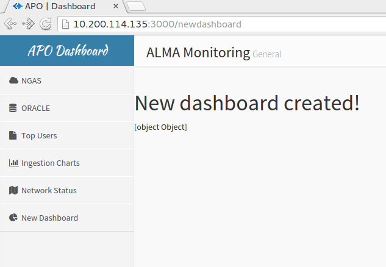
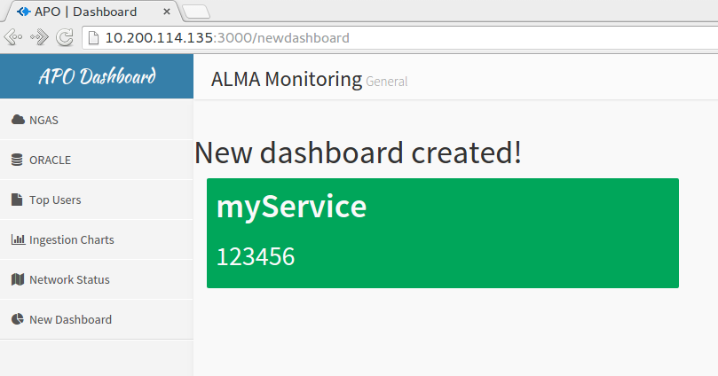
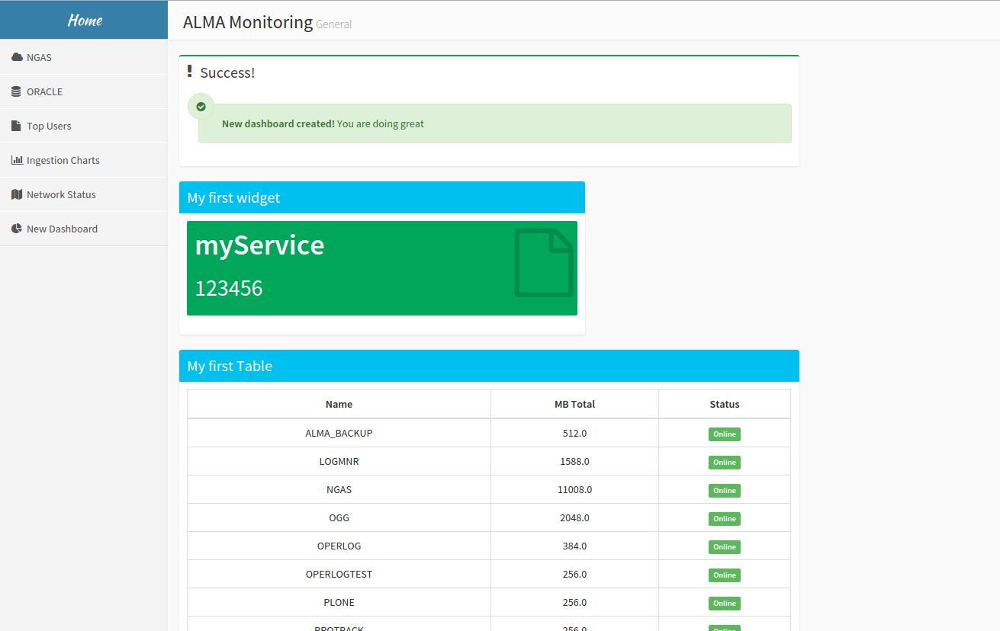

# APO-Dashboard

Source Code for APO Dashboards

The basic structure for the dashboard is: <br>

APO<br>
├── package.json<br>
├── README.md<br>
└── web <br>
&nbsp;&nbsp;&nbsp;&nbsp;&nbsp; &nbsp;&nbsp;   ├── app.js <br>
&nbsp;&nbsp;&nbsp;&nbsp;&nbsp; &nbsp;&nbsp;   ├── config.js <br>
&nbsp;&nbsp;&nbsp;&nbsp;&nbsp; &nbsp;&nbsp;   ├── LICENSE <br> 
&nbsp;&nbsp;&nbsp;&nbsp;&nbsp; &nbsp;&nbsp;   ├── package.json <br>
&nbsp;&nbsp;&nbsp;&nbsp;&nbsp; &nbsp;&nbsp;   ├── routes <br>
&nbsp;&nbsp;&nbsp;&nbsp;&nbsp; &nbsp;&nbsp; │   &nbsp;&nbsp;   ├── charts.js <br>
&nbsp;&nbsp;&nbsp;&nbsp;&nbsp; &nbsp;&nbsp; │   &nbsp;&nbsp;&nbsp;   ├── index.js <br>
&nbsp;&nbsp;&nbsp;&nbsp;&nbsp; &nbsp;&nbsp; │   &nbsp;&nbsp;&nbsp;   ├── map.js <br>
&nbsp;&nbsp;&nbsp;&nbsp;&nbsp; &nbsp;&nbsp; │   &nbsp;&nbsp;&nbsp;   ├── misc.js <br>
&nbsp;&nbsp;&nbsp;&nbsp;&nbsp; &nbsp;&nbsp; │   &nbsp;&nbsp;&nbsp;   ├── ngas.js <br>
&nbsp;&nbsp;&nbsp;&nbsp;&nbsp; &nbsp;&nbsp; │   &nbsp;&nbsp;&nbsp;   ├── oracle.js <br>
&nbsp;&nbsp;&nbsp;&nbsp;&nbsp; &nbsp;&nbsp; │   &nbsp;&nbsp;&nbsp;   ├── scripts.js <br>
&nbsp;&nbsp;&nbsp;&nbsp;&nbsp; &nbsp;&nbsp; │   &nbsp;&nbsp;&nbsp;   └── topusers.js <br>
&nbsp;&nbsp;&nbsp;&nbsp;&nbsp; &nbsp;&nbsp; └── views <br>
&nbsp;&nbsp;&nbsp;&nbsp;&nbsp;&nbsp;&nbsp;&nbsp;&nbsp;&nbsp;&nbsp;&nbsp;&nbsp;&nbsp; &nbsp;&nbsp;     ├── charts.jade <br>
&nbsp;&nbsp;&nbsp;&nbsp;&nbsp;&nbsp;&nbsp;&nbsp;&nbsp;&nbsp;&nbsp;&nbsp;&nbsp;&nbsp; &nbsp;&nbsp;     ├── empty.jade <br>
&nbsp;&nbsp;&nbsp;&nbsp;&nbsp;&nbsp;&nbsp;&nbsp;&nbsp;&nbsp;&nbsp;&nbsp;&nbsp;&nbsp; &nbsp;&nbsp;     ├── error.jade <br>
&nbsp;&nbsp;&nbsp;&nbsp;&nbsp;&nbsp;&nbsp;&nbsp;&nbsp;&nbsp;&nbsp;&nbsp;&nbsp;&nbsp; &nbsp;&nbsp;     ├── index.jade <br>
&nbsp;&nbsp;&nbsp;&nbsp;&nbsp;&nbsp;&nbsp;&nbsp;&nbsp;&nbsp;&nbsp;&nbsp;&nbsp;&nbsp; &nbsp;&nbsp;     ├── layout.jade <br>
&nbsp;&nbsp;&nbsp;&nbsp;&nbsp;&nbsp;&nbsp;&nbsp;&nbsp;&nbsp;&nbsp;&nbsp;&nbsp;&nbsp; &nbsp;&nbsp;     ├── map.jade <br>
&nbsp;&nbsp;&nbsp;&nbsp;&nbsp;&nbsp;&nbsp;&nbsp;&nbsp;&nbsp;&nbsp;&nbsp;&nbsp;&nbsp; &nbsp;&nbsp;     ├── mapold.jade <br>
&nbsp;&nbsp;&nbsp;&nbsp;&nbsp;&nbsp;&nbsp;&nbsp;&nbsp;&nbsp;&nbsp;&nbsp;&nbsp;&nbsp; &nbsp;&nbsp;     ├── ngas.jade <br>
&nbsp;&nbsp;&nbsp;&nbsp;&nbsp;&nbsp;&nbsp;&nbsp;&nbsp;&nbsp;&nbsp;&nbsp;&nbsp;&nbsp; &nbsp;&nbsp;     ├── oracle.jade <br>
&nbsp;&nbsp;&nbsp;&nbsp;&nbsp;&nbsp;&nbsp;&nbsp;&nbsp;&nbsp;&nbsp;&nbsp;&nbsp;&nbsp; &nbsp;&nbsp;     └── topusers.jade <br>


Usage:<br>


<h1>Adding a new dashboard</h1>
1) Copy the file routeTemplate.js in APO/web/routes and rename it to the name of your new dashboard route:<br>
`cp routeTemplate.js newdashboard.js`

2) Copy the file viewTemplate.jade in APO/web/views and rename it to the name of your new dashboard view: <br>  
`cp viewTemplate.jade newdashboard.jade`

3) Add your new dashboard to the APO/web/app.js file in the Adding Routes section: <br>
`var newdashboard = require('./routes/newdashboard');`  <br>

and letting node use the route in the Mounting Middlewares section: <br>
`app.use('/newdashboard',newdashboard);`  <br>

4) Go to APO/web/views and edit the layout.jade file, to add the new dashboard to the main view. Please remember that jade files uses tabs OR 4 spaces, but can not use both at the same time.
```html
a(href='newdashboard')
	i.fa.fa-pie-chart
	| New Dashboard
```


5) Go to APO/web and hit <br>
`npm start`

6) Now you can go to your favorite browser and enter http://10.200.114.135:3000 and you should be able to see this:




Now we are adding some pannels with information stored in mongodb, but first we are going to populate a mongodb collection (A.K.A Table in RDBMS).

<h1>Handling mongoDB Data </h1>
Enter the mongo Shell: <br>
`mongo` <br>
Show databases: <br>
`show dbs` <br>
In this example we will be working with the database that I am already using, which name is 'test'. We could create more databases in this mongo instance, but we would need to edit the APO/web/config.js file, and add the other database here, and we may need to rewrite the app in order to access multiple databases (and honestly I don't really know how to do it.) <br>   
`use test`    <br>
We can see the collections by typing: <br>    
`show collections`    <br>
Currently this is the list of collections in mongo:<br>

```
asdms 
asdms365
asmosf
asmsco
datasize
datasize365
ingestionosf
ingestionsco
monitoring
ngaspartitionsosfbe
ngaspartitionsosffe
ngaspartitionssco
oracleStatus
oraclestatus
tablespacesosf
tablespacessco
tablesspacesosf
tablesspacessco
```
Let's check the content of some collection by typing: <br>
`db.monitoring.find()`<br>
Since this make our eyes bleed we can do just: <br>
`db.monitoring.find().pretty()` <br>
We can find a lot of funier queries in the link below: <br>

LINK

<h1>Inserting data into mongoDB from a python script</h1>
Create a python script myscript.py with the following code inside:

```python
from pymongo import MongoClient
from datetime import datetime

client = MongoClient()
#db = client.dbname, dbname is the name of the db in mongo. Here I will use the db 'test'.
db = client.test

servicename = "myService"
data = 123456

result = db.testing.insert_one({
    "servicename" : servicename,
    "data": data,
    "timestamp" : datetime.now()
})
```
Note that we do not need to create a collection before, since if it not exists, it will be created while inserting records.
Now we run the script:<br>
`python myscript.py`
It will insert the new record in the $testing$ collection.
<h1>Creating a route that connects to mongoDB</h1>
There is a template file also, that contains all the basic stuff to retrieve data from mongo. Most of the routes (all of them actually) requires multiple calls to different collections, or multiple http calls, so that's why I use the async module, because it allows to make this calls in a asynchronous way, and then retrieve the results, do whatever I want with them, and then send the data to the view.<br>
So let's get started. Go to the routes directory and edit the newdashboard.js file. Erase the res.render('newdashboard') line, and add the following inside the router.get function:

```javascript
var db = req.db;
var collection = db.collection('testing');
collection.find().toArray(function(err,result){
	if (err) {console.log(err)}
	else {console.log("We've got results!")}
	console.log(result)
	res.render('newdashboard',{data:result})
});
```
Then go to the view, and show the results on the webpage. To do this, edit the newdashboard.jade file in APO/web/views. Below the Main content section, add the following line:
```
       // Main content
        section.content
                .row
                        h1 New dashboard created!
                        p #{data}

```
Jade receives the data variables comming from NodeJS with a #{}. At this time, if you go back and start the server again, you should see this in the ddashboard:





and this in the server console:
```
We've got results!
[ { _id: 56e6f5709bcea64182e122b9,
    timestamp: Mon Mar 14 2016 17:31:28 GMT+0000 (UTC),
    servicename: 'myService',
    data: 123456 } ]
```
This is not very useful, so let's print this information in the dashboard, by modifying the route:

```javascript
var db = req.db;
var collection = db.collection('testing');
collection.find().toArray(function(err,result){
        if (err) {console.log(err)}
        else {console.log("We've got results!")}
        console.log(result)
	var mystring = result[0]["servicename"] + " , " + result[0]["data"]
        res.render('newdashboard',{data:mystring})
});
```
We do not need to modify the view, since the only thing that changed is the content of the 'data' variable.

<h1> Creating our first widget </h1> 
Now that we know how to store data in mongo, retrieve it nodejs, and sending it to the AdminLTE views, we are going to create our first widget.
For this example we will be using the files that we just modified, this are newdashboard.jade and newdashboard.js. Edit the newdashboard.js:


```javascript
var db = req.db;
var collection = db.collection('testing');
collection.find().toArray(function(err,result){
        if (err) {console.log(err)}
        else {console.log("We've got results!")}
        console.log(result)
	var name = result[0]["servicename"] 
	var data = result[0]["data"]
        res.render('newdashboard',{
		myname:name,
		mydata:data
	})
});
```

edit the newdashboard.jade file:
```html
.row
	.col-lg-4
		.small-box.bg-green
			.inner
				h3
					| #{myname}
				h2
					| #{mydata}
				
			.icon
				i.fa.fa-file-o
	
```
Here we are declaring a new row, so everything that is above that row will not be modified. Please note that the dashboard is one big column of size 12, so we can split the column as we want. Here, our widget will be only of size 4.
If you restart the server, you should see this:





<h1> Creating a table </h1>
Now we are going to create a table. We are going to use a collection that is already created in mongodb, which name is 'tablespacessco'. You can inspect the collection in the mongoshell by typing:
`db.tablespacessco.find().pretty()`

Since we are going to leave right there our first widget that we just created, we are going to do 2 queries to mongo, one for the first widget, and one for the new table. If we want to send data from multiple queries in the same response, we need to import the async module. If it is not installed, you can install it with the Node Package Manager: 
`npm install async`

This will require to change our route a little bit:

```javascript
var express = require('express');
var mongodb = require('mongodb');
var async = require('async');
var router = express.Router();

router.get('/', function(req, res) {

        async.parallel([
                function(callback){
                        var db = req.db;
                        var collection = db.collection('testing');
                        collection.find().toArray(function(err,result){
                                if (err){
                                        console.log(err);
                                        callback(err);
                                }
                                else if (result.length){console.log("We've got results!");}
                        callback(null,result);
                        });
                },
                function(callback){
                        var db = req.db;
                        var collection = db.collection('tablespacessco');
                        collection.find().sort({timestamp:-1}).limit(1).toArray(function(err,result){

                                if (err){
                                        console.log(err);
                                        callback(err);
                                }
                                else if (result.length){console.log("We've got a table!");}
                                else {console.log("No results");}
                        callback(null,result);
                        });
                }


	],
	
	//results comes in an array in the results variable. results[0] is the first query, results[1] is the second query, and so on...
	function(err,results){
		if (err){
                        console.log(err);
                        return res.send(400);
                }
                data1 = results[0]
                scotable = results[1]

		res.render('newdashboard',
			{
				data1:data1,
				data2:scotable
			}
		)
	}
});
module.exports = router;
```

And then we need to edit the newdashboard.jade file. Edit the Main content section only:

```html
 section.content
                .row
                        .col-md-6
                                .box.box-success
                                        .box-header
                                                i.fa.fa-exclamation
                                                h3.box-title Success!

                                        .box-body
                                                .alert.alert-success
                                                        i.fa.fa-check-circle
                                                        b New dashboard created!
                                                        | You are doing great
                .row
                        .col-lg-4
                                .box.box-solid.box-info
                                        .box-header
                                                h3.box-title My first widget
                                        .box-body
                                                .small-box.bg-green
                                                        .inner
                                                                - var myname = data1.servicename
                                                                - var mydata = data1.data
                                                                h3
                                                                        | #{myname}
                                                                h2
                                                                        | #{mydata}

                                                        .icon
                                                                i.fa.fa-file-o
                .row
                        .col-lg-6
                                .box.box-solid.box-info
                                        .box-header
                                                h3.box-title My first Table
                                        .box-body
                                                table.table.table-bordered.table-hover
                                                        thead
                                                                tr
                                                                        th Name
                                                                        th MB Total
                                                                        th Status
                                                                tbody
                                                                each key in data2
                                                                        td #{key.name}
                                                                        td #{key.mbtotal}
                                                                        td
                                                                                - var status = key.status
                                                                                if status == "ONLINE"
                                                                                        span.label.label-success Online
                                                                                else
                                                                                        span.label.label-danger Danger
                                                                        tr

```
If everthing went well, then you should be able to see something like this:


Please note that we added the widgets inside a box. Also here I am using another way to retrieve variables from NodeJS. Jade allows the use of variables, conditionals and loops, and it is also allows to write inline javascript code (See http://jade-lang.com/reference/code/). So when we declare:
`- var status = key.status`
it means that we are reading the key 'key' that comes from the router (which is basically a json document), and the value 'status'. The same goes for every key, since they are inside a loop that searchs every key in the json file. (I Hope I am being clear here.)
Conditionals makes us change the color of the status field in a table.
 


<h1> Creating a bar chart</h1>
In order to create a bar chart, it is basically the same as before. Here we are going to read data ingested last 30 days. Note that these queries fo directly to mongo, and not to oracle. Edit the newdashboard.js route: <br>

We add the new function to the async.parallel array:
```javascript
                function(callback){
                        var db = req.db;
                        var collection = db.collection('datasize');
                        collection.find().sort({date:-1}).limit(30).toArray(function(err,result){

                                if (err){
                                        console.log(err);
                                        callback(err);
                                }
                                else if (result.length){console.log("We've got data ingested!");}
                                else {console.log("No results");}
                        callback(null,result);
                        });
                }


```

Then we edit the results of the async, basically send the new data to the view. Note that we are console.logging everything into the npm server, so this way you can see the data you are sending (check the shell that is running the server to see the logs):
```javascript
       function(err,results){
                if (err){
                        console.log(err);
                        return res.send(400);
                }
                data1 = results[0][0]
                scotable = results[1][0]["data"]
                dataingested = results[2]

                var chart1 = []

                console.log(dataingested)
                //handling the data comming from mongo
                for (var i = dataingested.length-1;i>=0;i--)
                {
                        var formatedResult = dataingested[i];
                        var date = formatedResult["date"];
                        var tar= formatedResult["tar"];
                        var science = formatedResult["science"]
                        chart1.push({x:date, ytar:tar,yscience:science});

                }


                console.log(data1)
                console.log(scotable)
                console.log(chart1)
                res.render('newdashboard',
                        {
                                data1:data1,
                                data2:scotable,
                                data3:chart1
                        }
                )
        //end function results
        }


```
Now it's time to edit the view file, but this time it will be a little tricky, since we are going to use the morris module, which allows us to draw bar, line, and area charts. For more documentation please go to: http://morrisjs.github.io/morris.js/ 
The current version of AdminLTE currently supports:
Morrisjs
Chartsjs
Flot
FusionCharts (I added this one)
If you want to add more javascripts charts, you can download them (as long as they are free), store them in the APO/web/public/plugins directory, and adding them in the jade file at the end.


Finally we edit the view file, make sure to put it inside the second row:
```html
                       .col-lg-8
                                .box.box-solid.box-info
                                        .box-header
                                                .pull-right.box-tools
                                                        button.btn.btn-info.btn-sm(data-widget='collapse',data-toggle='tooltip',title='Collapse')
                                                                i.fa.fa-minus
                                                h3.box-title Data ingested last 30 days
                                        .box-body.chart-responsive
                                                #bar-chart1.chart(style='height: 140px;')


```
But we are just accessing an html id that is called 'bar-chart1' (note the #). So we need to create a script that uses the javascript libraries that renders the charts. If you go down in the code, you can see all the javascript scripts that are being imported, and we can write our own scripts with the 'script.' tag:
```javascript
        script.
                Morris.Bar({
                        element: 'bar-chart1',
                        data: !{JSON.stringify(data3)},
                        xkey: 'x',
                        ykeys: ['ytar','yscience'],
                        labels: ['TAR','Science'],
                        stacked: 'true',
                        hideHover: 'auto',
                        barColors: ["#0098ef", "#00a65a"]
                });

```
Here we are telling the Morris module that it should take the data3 variable comming from node, and render a map.
If everything went well you should see this:


